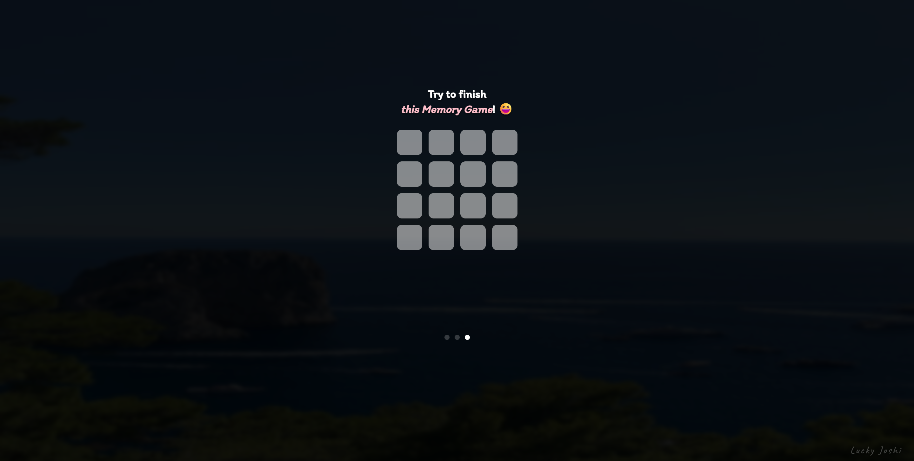

# Memory Game

A simple and interactive memory game built with JavaScript, HTML, and CSS. Test your memory skills by matching pairs of cards!

## Features

- Flip cards to find matching pairs
- Tracks moves and time taken
- Responsive design for desktop and mobile
- Restart and play again functionality

## Getting Started

1. **Clone the repository:**
    ```bash
    git clone https://github.com/Lucky-Joshi/Memory-Game.git
    ```
2. **Open `index.html` in your browser.**

## How to Play

1. Click on a card to flip it.
2. Flip another card to find its match.
3. Match all pairs to win the game.
4. Try to complete the game in the fewest moves and shortest time!

## Technologies Used

- HTML5
- CSS3
- JavaScript

## Screenshots



## License

This project is licensed under the MIT License.

---

*Happy playing!*